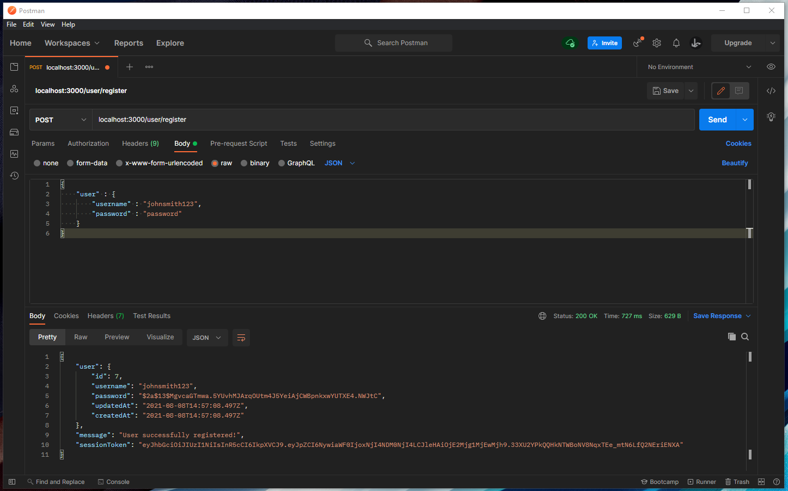
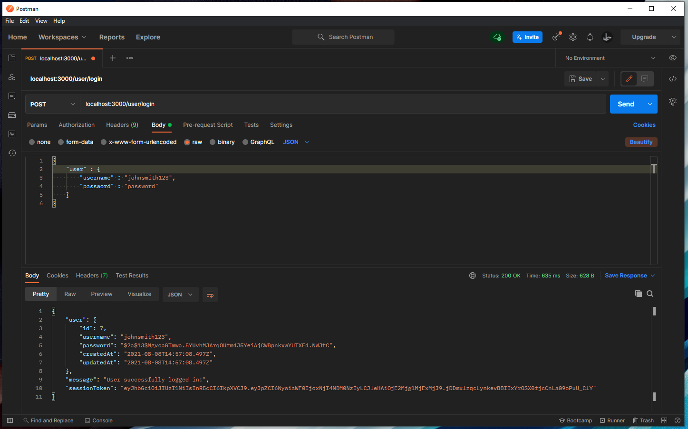
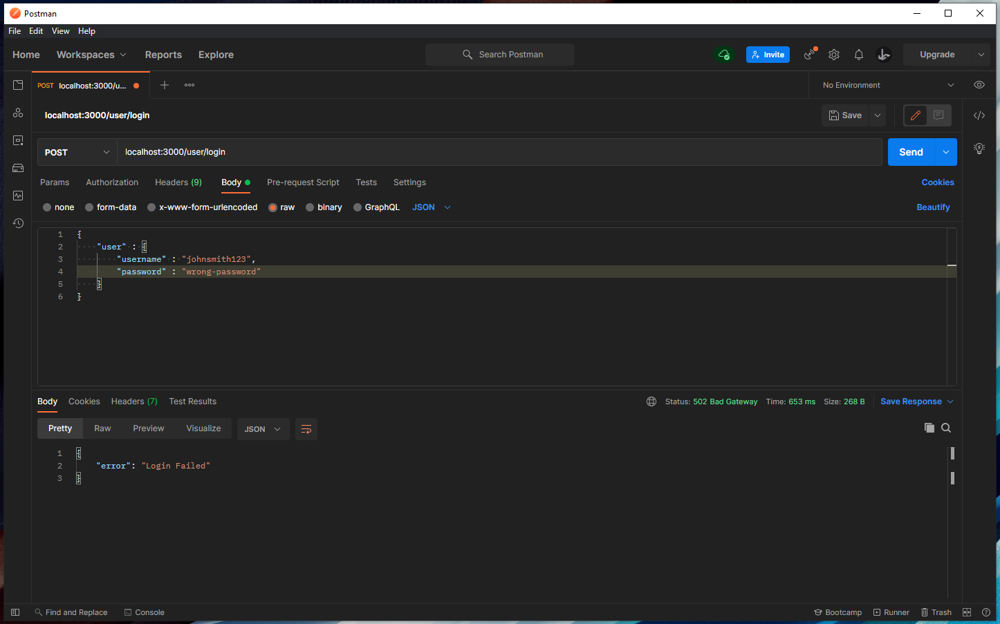
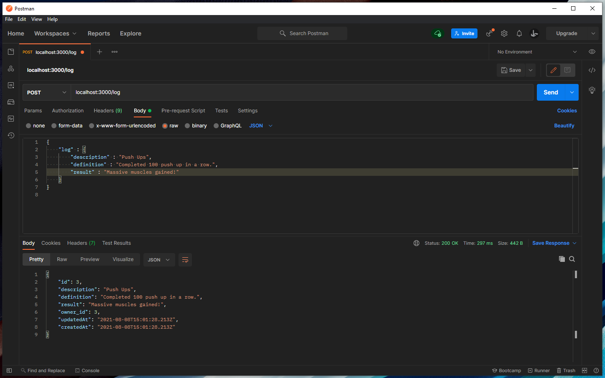
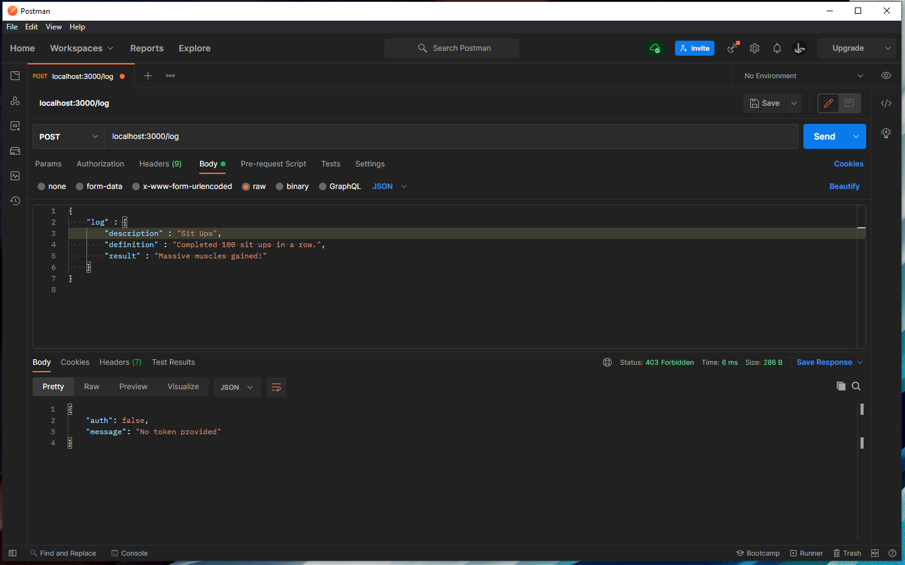
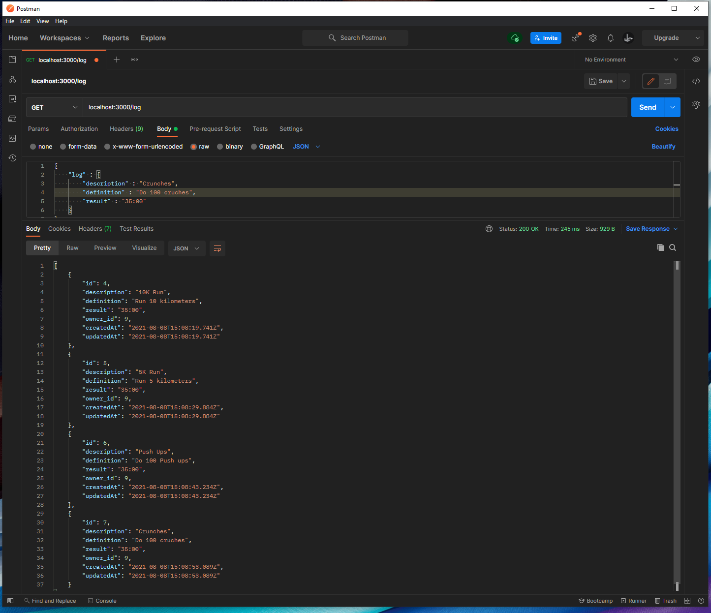
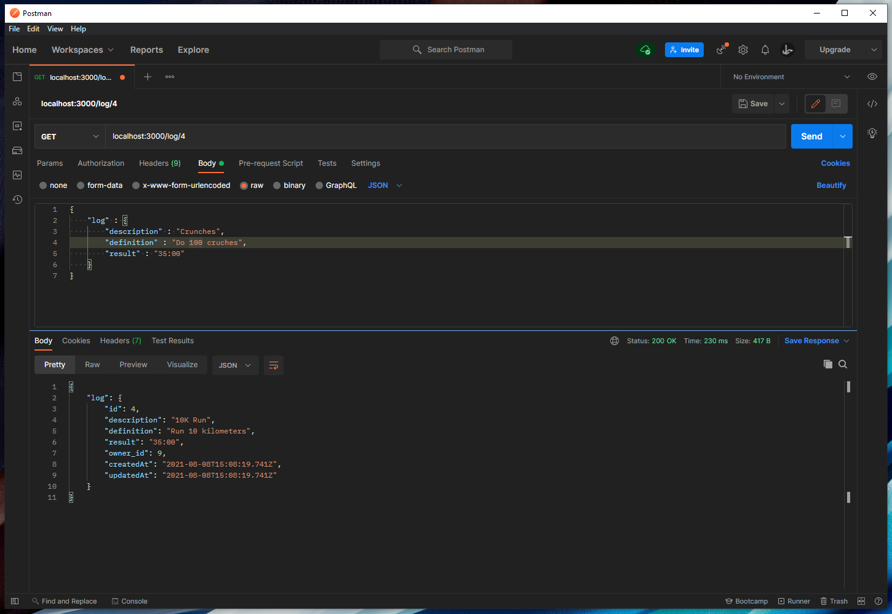
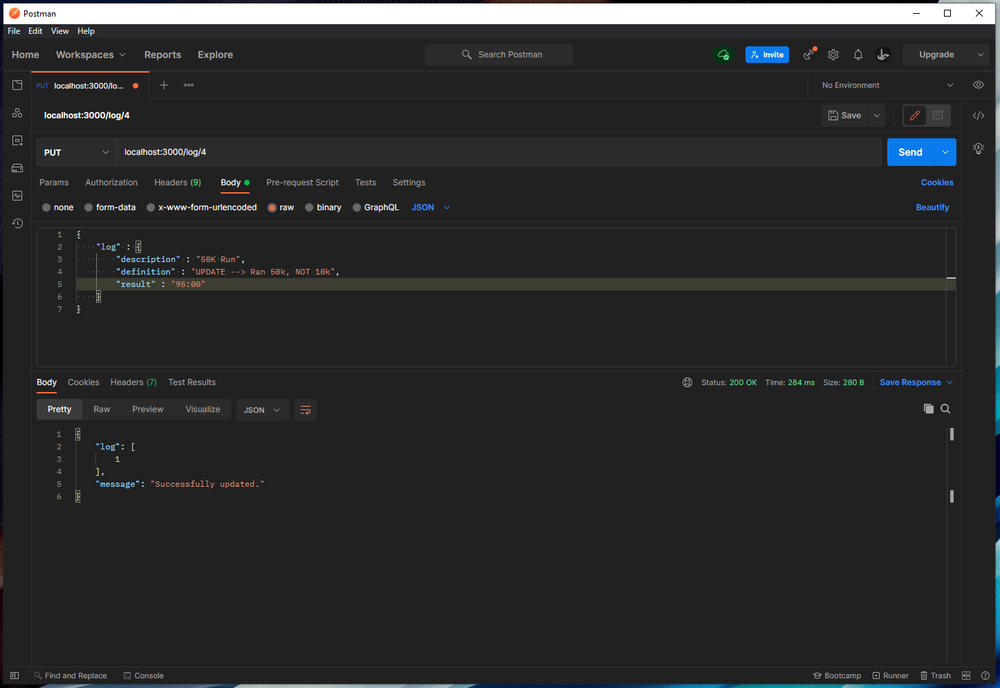
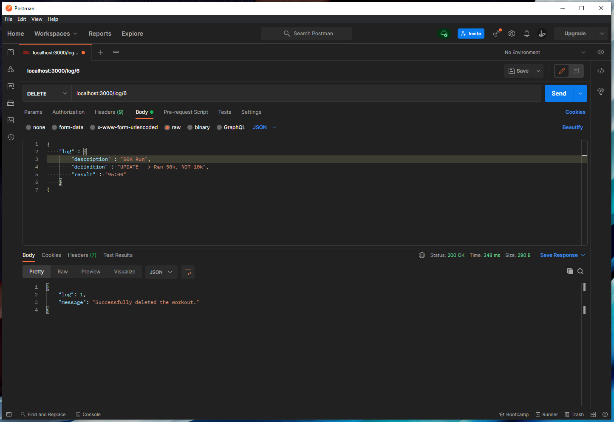

# Workout Logbook Server Build

## My Experience & Confidence with the Subjects at Hand

This repo is my first build of a server on my own after learning the step by step process taught to me by the cirriculum at Eleven Fifty Academy.

When working with the initial set up of each component and the respective endpoints, I am very comofortable and confident in my abilities to get the sever working as intented. Where I feel a little shaking on fully grasping the concepts is with bcrypt/JWT - I can manage to get them to work with some referencing of previous server work, but it would have been a lot harder with out them. The piece of the puzzle I struggle with the most though is fully understanding the middleware portion and grasping everything that happens within that file. Overall, after completing this assignment I feel far more competent setting up the back-end server side of these kinds of project.

Below are screenshots of all my working endpoints:

## Registering a User

## Login - SUCCESS

## Login - FAIL

## Create a log - SUCCESS

## Create a log - FAIL (No Authentication Token)

## Get all logs by individual user

## Get individual logs by id for an individual user

## Update a log

## Delete a log

